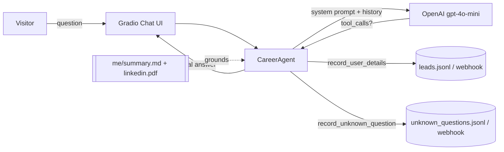

<div align="center">

# 💬 Chat with Shubham — AI Career Agent

**An LLM agent that answers questions about me — in my voice — for recruiters, hiring managers, and fellow engineers.**

[](https://www.python.org/)
[](https://platform.openai.com/)
[](https://www.gradio.app/)
[](#-live-demo)
[](LICENSE)

</div>

---

## 🚀 Live demo
👉 **[Chat with my AI agent](#)** *(link added after deployment)*

Ask it things like:
> *"What's Shubham's backend experience?"* · *"Has he worked with LLMs?"* · *"Tell me about a hard bug he fixed."*

---

## 🧠 What it does
A conversational agent that represents me faithfully on my portfolio. It:
- answers from a **curated knowledge base** (my experience, skills, projects),
- **never fabricates** — if it doesn't know, it says so and logs the question,
- **captures leads** — if you're interested, it collects your email so I can follow up,
- runs on **OpenAI function-calling** so those actions are real tool calls, not guesses.

## 🏗️ Architecture



The agent loops: it calls the model, and while the model requests tools, it executes them and
feeds results back — only returning to the user once the model produces a final answer.

## ✨ Features
| | |
|---|---|
| 🎭 **Faithful persona** | First-person, grounded strictly in an editable knowledge base |
| 🛡️ **Anti-hallucination** | Unknown questions are logged, not invented |
| 📬 **Lead capture** | Collects interested visitors' emails via a tool call |
| 🆓 **No paid add-ons** | Notifications via local files + optional free webhook (e.g. ntfy.sh) |
| 🧩 **Config-driven** | Swap the persona/knowledge base with zero code changes |
| 🐳 **Reproducible** | Runs in Docker or one-click on Hugging Face Spaces |

## 🧰 Tech stack
**Python · OpenAI (tool-calling) · Gradio · pypdf · dotenv**

## 📂 Project structure
```
ai-career-agent/
├── app.py          # Gradio UI + launch
├── agent.py        # CareerAgent: prompt, chat loop, tool dispatch
├── tools.py        # tool schemas + implementations (lead capture, unknown Q)
├── config.py       # persona + settings (env-overridable)
├── me/summary.md   # my story — the single editable source of truth
└── requirements.txt
```

## ⚡ Run it yourself
```bash
# 1. add your key
cp .env.example .env        # then set OPENAI_API_KEY

# 2. install + run
pip install -r requirements.txt
python app.py               # opens http://localhost:7860
```

## ☁️ Deploy (Hugging Face Spaces)
1. Create a new **Gradio** Space.
2. Push this folder to it.
3. Add `OPENAI_API_KEY` under **Settings → Secrets**.
That's it — the Space runs `app.py` automatically.

## 📝 Notes
Built as the foundational project while transitioning from backend engineering into
AI/LLM engineering — the first of several agentic + RAG projects in my portfolio.

---

<div align="center">

**Shubham Singh** — Backend + AI Engineer
[GitHub](https://github.com/ShubhamTheSingh) · LinkedIn *(soon)*

</div>
